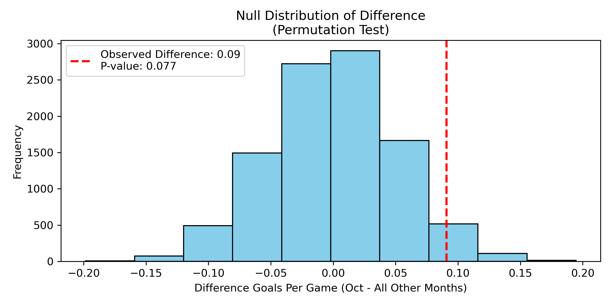
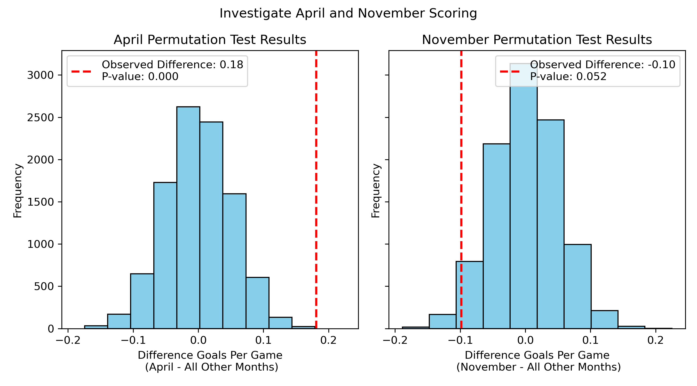
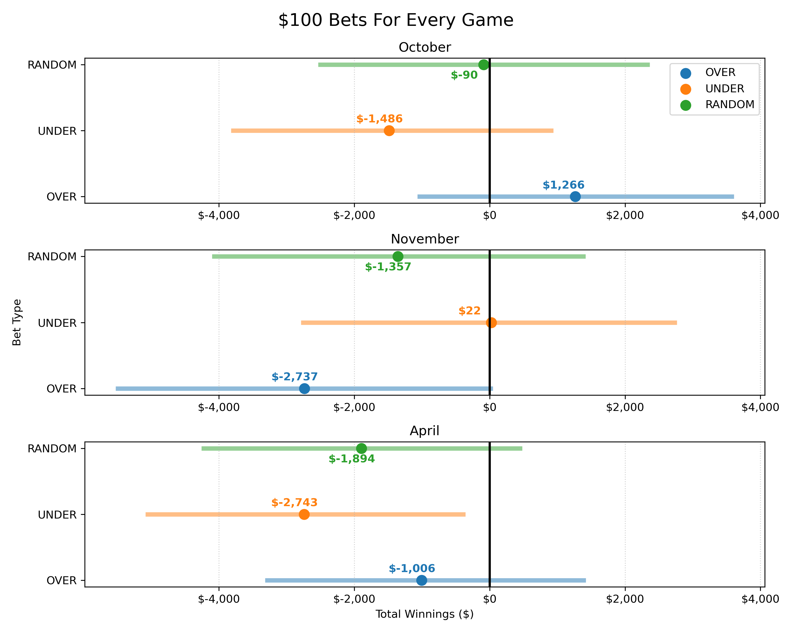
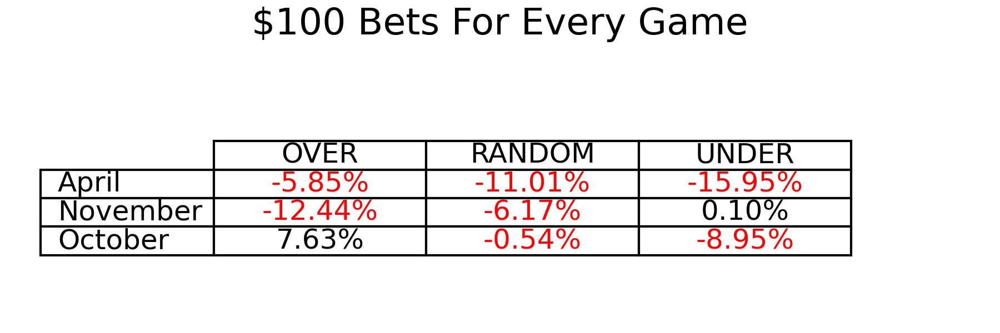

## NHL Scoring Data Analysis

This repository was built for a data analysis class. Below I have laid out the research information that is relevant. 

The project will use NHL game results from MoneyPuck.com and BigDataBall.com to analyze various scoring trends and over/under betting results.

### MoneyPuck.com
I have downloaded game data from [MoneyPuck.com](https://moneypuck.com/data.htm). Halfway down the data page is a link to "download all game level data for all teams for all seasons in one file here". This will give you a all_teams.csv file with the data I am working with.

### BigDataBall.com
I have purchased the box scores for the 2024-2025 NHL season with Over/Under lines and odds from [BigDataBall.com](https://www.bigdataball.com/datasets/nhl/team/2024-2025/). This data includes scoring data as well as Over/Under lines and odds for each game.

## 1. Research Question and Background

A friend told me that supposedly people should "Hammer the over in October" for NHL hockey. This means that people should be on the "Over" for the first month of the season. The logic seems to be that scoring is up the first month of the season and because of that, the "Over" tends to hit more often than the rest of the year. 

When I heard this "advice" I was skeptical so I did some googling and asking of ChatGPT. When I googled I found a blog article from a betting website with some data visualizations focused on the scoring trends of the start of the season. ChatGPT gave me a list of reasons scoring is up at the start of the season:
- Defenses and goalies needing time to get to peak form and coordination.
- New players and lines adjusting—leading to defensive mistakes.
- Shorter/less intense training camps or preseason preparation.
- Occasionally, rule changes resulting in more power plays or open games.

Basically everyone is pointing at scoring but I'm skeptical scoring is up significantly to start the season so the question I am going to research is:

**Is scoring significantly up the first month of the season?**

## 2. Hypothesis

Null Hypothesis: The mean number of goals per game in October is not higher than the mean number of goals per game in the rest of the NHL season.

Alternative Hypothesis: The mean number of goals per game in October is higher than the mean number of goals per game in the rest of the NHL season.

## 3. Data Description

There are two sources of data (see above)

* Every row represents a game played
    * MoneyPuck data runs back to the 2008-2009 season
    * BigDataBall is just the 2024-2025 season
* We are focused on the goals scored, month and Over/Under lines for regular season games
* Filtering, cleaning, or transformation steps:
    - I filtered out playoff games and irregular season (COVID and lockout shortened) because they didn't align with what I was analyzing.
    - I detail in [Over Under EDA](./over-under-EDA.ipynb) the transformation steps done to combine the rows into a single game and how I parsed the lines and odds

## 4. Methods

### Analyzing Scoring

To analyze the scoring I compared the mean goals per game of a given month subtracted from the mean goals per game for the rest of the season. 

I ran a permutation test by shuffling the months the games were played and re-calculating the difference.

After creating a null-distribution I calculated a p-value for the selected month to evaluate if the scoring for that month was statistically significant.

### Bootstrapped Confidence Intervals

I used the box scores for the 2024-2025 season to create confidence intervals around the amount of money someone would win or lose betting over a month. I had the simulation run so that the person either bet the "Over" on every game, the "Under" on every game or used a coin-flip to chose the "Over/Under" for every game.

I selected a month to run the simulation and than 10k times I:
1. Bootstrapped the samples for that month
2. Selected a designated amount of games to wager on at random from the samples
3. Calculated the total wins or losses given a specified wager and bet type (OVER/UNDER/RANDOM)

I used the 10k results to build a 95% confidence interval for each bet type for the 3 months we identified as interesting in the scoring analysis (October, November and April).

## 5. Results

### Analyzing Scoring

I found that scoring in October is not statistically significant compared to the rest of the season (p=.075). However, scoring in November (lower p=.05) and April (higher p=.00) was!

### Analyzing Bootstrapped CIs

Interestingly enough, it turns out that you can make money betting the over in October. At least based on the data from the 2024-2025 season. I was able to build confidence intervals, see below, to demonstrate the amount of money you can expect to win or lose given a set of betting scenarios. The October Over bet was the clear best bet of all the scenarios. Below are the results for betting every game of the month. See results/ for variations on number of games bet per month.

October provided an average of 7.5% ROI

I think the reason that the first month of the season Over hits more frequently has more to do with uncertainty for how every team is going to look and play at the start of a seasons and less to do with scoring being up. Oddsmakers use historical data to set lines and the lack of that in new seasons are probably the biggest influencer at play.

## 6. Uncertainty Estimation

### How many resamples used 
- For both the permutation tests and the bootstrapped confidence intervals, I used 10,000 resamples in each simulation. 

### What did randomization distributions looked like:  
The permutation test distributions were approximately normal and centered around zero, as expected under the null hypothesis. The observed test statistics were compared to these distributions to compute p-values.   

### How you interpret the interval estimates 
For the permutation tests, if the observed difference in scoring for a month fell in the tails of the null distribution I interpreted this as evidence that scoring in that month was significantly different from the rest of the season.

The 95% confidence intervals from the bootstrap simulations represent the range of total winnings we would expect if the same betting strategy were repeated many times under similar conditions. If the interval is entirely above zero, it suggests a likely profit; if it includes zero, the outcome is uncertain; and if it is entirely below zero, it suggests a likely loss.  

## 7. Limitations

My only real limitation here was that I didn't have betting lines for data other that the 2024-2025 season. I would like to see if the start of seasons trends held over multiple seasons and that's why my permutation test is on the other data set. I think that season to season analysis gives a more full picture.

## 8. References

[Betting Blog For Scoring](https://www.slapshotbets.com/articles-1/goal-scoring-at-beginning-of-season#:~:text=As%20seen%2C%20in%2014%20out,arbitrary%20cutoff%20on%20its%20own.)

Data Sets:
[MoneyPuck.com](https://moneypuck.com/data.htm)
[BigDataBall.com](https://www.bigdataball.com/datasets/nhl/team/2024-2025/)